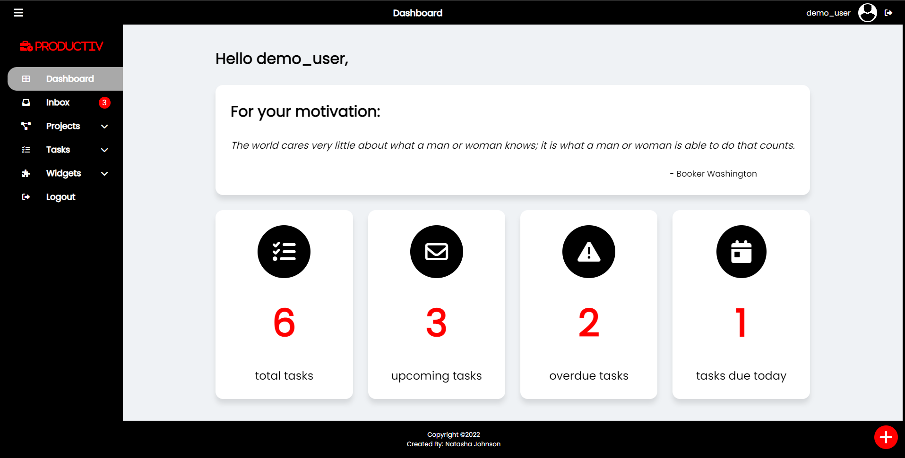

# Productiv

- [Description](#description)
  - [Built With](#built-with)
  - [Screenshots](#screenshots)
  - [Links](#links)
- [Author](#author)

## Description

Productiv is a dashboard application that solves the problem of having to switch between multiple applications to maintain productivity. A user is able to add tasks organized by project type as well as date. To aid the user in keeping deadlines, tasks are automatically added to the inbox that are due the current day. Productiv also includes widgets such as a Pomodoro Timer and calculator.

### Built With
- Html5
- Css/Sass
- JavaScript
- Firebase Firestore
- Firebase Authentication
- Quotes API
- Async/Await
- ES6 Modules
- ES6 Classes

### Screenshots

### Links

- Live Site URL: [https://artsycoder533.github.io/productiv/](https://artsycoder533.github.io/productiv/)
- Repository URL: [https://github.com/artsycoder533/productiv.git](https://github.com/artsycoder533/productiv.git)
- Video Demo Playlist on Youtube: [https://youtube.com/playlist?list=PL2WqH02famSWoIjSa2kHPvw6u7Qzsmshx](https://youtube.com/playlist?list=PL2WqH02famSWoIjSa2kHPvw6u7Qzsmshx)

## Author
Portfolio: [https://natashajohnson.dev/](https://natashajohnson.dev/)

